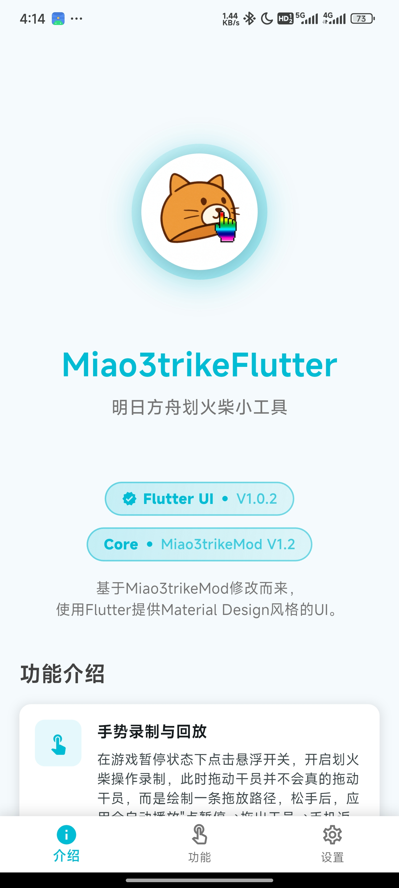
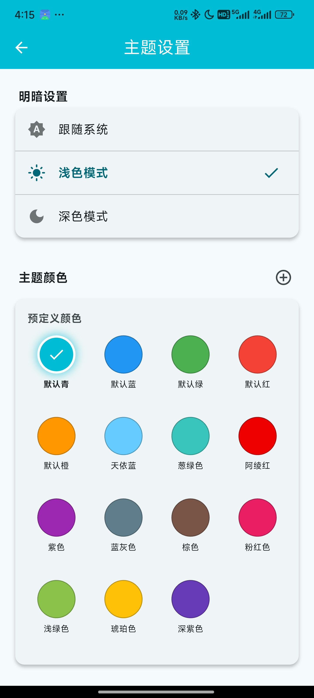
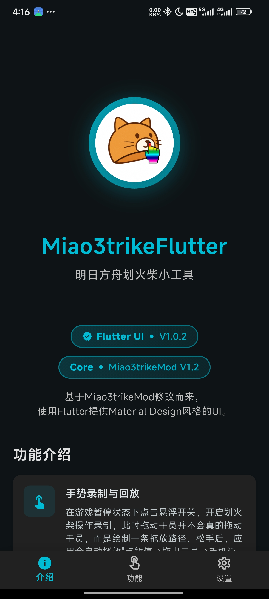
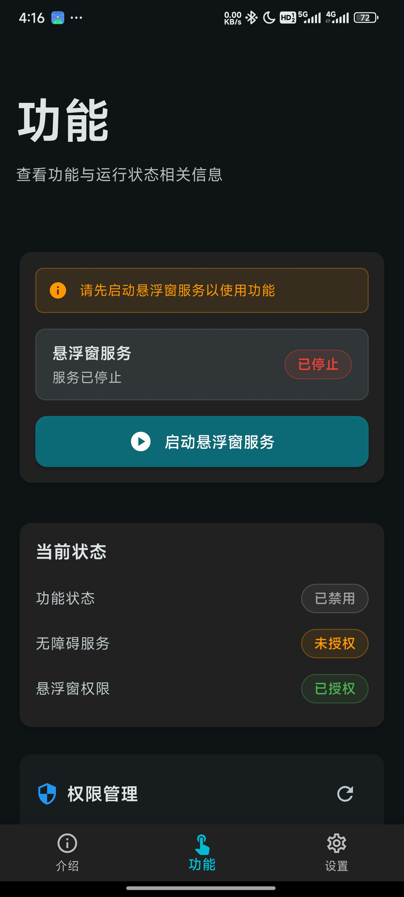
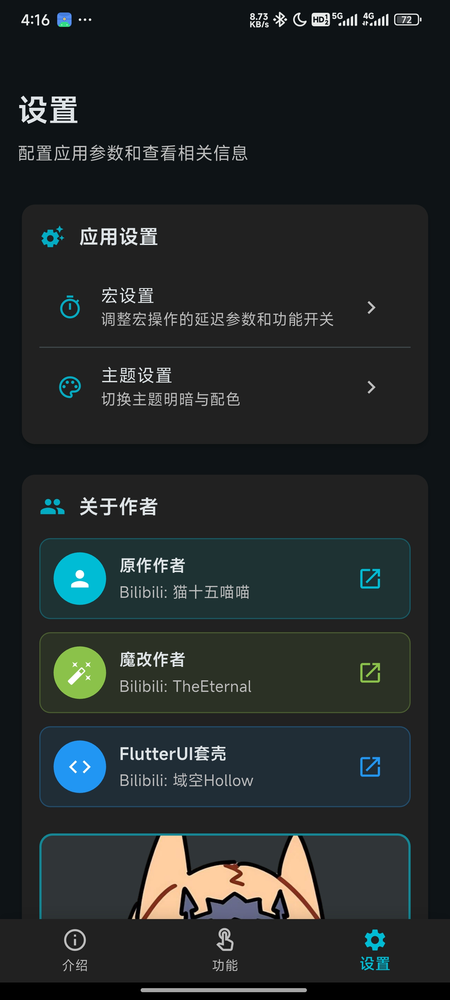
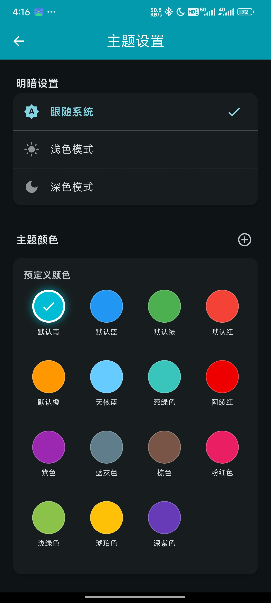

# miao3trikeflutter

  

  <h1 align="center">Miao3trike Flutter</h1>

  

    Miao3trikeFlutter：一个套了 Flutter 写的 Mental Design UI 的明日方舟手机版划火柴小工具的魔改版
     
    <a href="https://github.com/Hollow-YK/Miao3trike_Flutter/issues">报告 Bug</a>
  

  

    
    
    
    
  

---

## 下载与安装

请前往[Release](https://github.com/Hollow-YK/Miao3trike_Flutter/releases)下载最新安装包并安装。

## 简介

**Miao3trikeFlutter** 是一个基于 [**Miao3trikeMod**](https://github.com/SuperMaxine/Miao3trikeMod) 的 Android 应用。

> [!Tip]
>
> **可与原版、改版同时存在！**

因为前面的版本都是xml的UI，写了个看起来更丰富 ~~但是似乎没什么用~~ 的UI。
该版本使用Flutter编写UI部分，并通过AAR将原来的代码打包进来实现功能，所以理论上和原版一样 ~~（Bug应该也一样）~~

在使用该版本过程中发现的Bug请在本repo进行反馈，除非你能确定是来自 [**Miao3trikeMod**](https://github.com/SuperMaxine/Miao3trikeMod) 的代码导致的。
~~但是由于本人对Android原生开发可以说一窍不通，所以有些Bug可能不会修~~

### 软件截图

点击查看截图

| 主题模式 | 介绍页面 | 功能页面 | 设置页面 | 主题设置 |
|:---|:---|:---|:---|:---|
| **亮色模式** |  |  |  |  |
| **暗色模式** |  |  |  |  |

表格支持水平滚动，在窄屏幕上可左右滑动查看。点击任意图片可查看原图。

### 使用教程

**Miao3trikeFlutter** 功能使用方法与 **Miao3trikeMod** 几乎一样，若你使用过 Miao3trikeMod ，可以较快上手。

下面的使用教程是从 **Miao3trikeMod** 那里复制来的。

展开教程

- 划火柴：**第一次使用务必校准暂停按钮位置！（点击悬浮开关，将出现的蓝色按钮拖动到游戏中暂停按钮的真实位置，一次设置，永久生效）** 正常使用时，在**游戏暂停**状态下点击**悬浮开关**，开启划火柴操作录制，此时拖动干员并不会真的拖动干员，而是绘制一条拖放路径，松手后，应用会自动播放“点暂停→拖出干员→手机返回键”的宏操作，放置到位后之后需要自行调整干员朝向。
- 零帧撤退与放技能：在**游戏暂停**状态下按下手机的**音量+**按键，开启干员位置录制，此时点击干员位置，松手后，应用会自动播放“点暂停→点击干员→点暂停”的宏脚本，然后可以自己选择开干员技能或是撤退。
- 逐帧步进：在**游戏暂停**状态下按下手机的**音量-**按键，应用会自动播放“点暂停→等待→点暂停”的宏脚本，通过调整等待时间（“步进延迟”），可以以人类难以精确捕捉的时间逐帧步进游戏内时间，方便精细操作。

### 常见问题

这些也是从 **Miao3trikeMod** 那里复制来的。

1. 为什么一进去划火柴不成功反而还取消暂停了？
  - 有可能是模拟暂停按钮的位置不对，在划火柴模式下，将蓝色的示意点拖动到游戏中的暂停按钮位置再试试。
2. 为什么干员落地位置**不是我放置的位置**？
  - 因为干员拖动过程中地图会有倾斜效果，建议**先选中干员**将地图倾斜到位**再录制拖放路径**，从而避免自动操作时产生位置的干员落点偏移。
3. “启动延迟“是什么？
  - （TLDR：随便加，不影响划火柴，只影响你等脚本划完火柴的速度，但过低容易不稳定）录制拖放路径靠插入虚拟图层实现对手指位置的监控，如果参数中的启动延迟设置过小，会导致第一次暂停点击到虚拟图层从而取消暂停失败。最终表现为，划火柴失败，干员没放出来，并且解除了暂停。启动时间是在宏开始执行前的等待时间，即还没有解出暂停，因此增加这个参数并不会增加游戏内流动的时间。
4. “每步操作之间的延迟”是什么
  - 顾名思义，在划火柴“点暂停→拖出干员→手机返回键”每步操作之间的等待时间，同时也是零帧撤退与放技能“点暂停→点击干员→点暂停”每步操作之间的等待时间，一般0ms无问题，增加会增加操作时游戏内流过的时间。
5. “悬停延迟”是什么？
  - （TLDR：同“启动延迟“，也可以随便加，但过低容易不稳定）明日方舟将干员放在格子上需要你按着干员在格子上悬停一会儿才能确认位置并下落，如果直接拖过去0帧松手干员是落不下的。这个时间在脚本恢复暂停后才会开始等待，因此增加这个参数也不会增加游戏内流动的时间。
6. “拖动速度”是什么？
  - 是拖动干员到目标位置所需要的时间，是在游戏时间流动时进行的操作，增加该参数会真正增加划火柴时游戏内过去的时间。参数过小**可能会导致部分手机无法识别拖动操作**，仅在个人测试过的手机上可设置为1ms并保持稳定，0ms可能会导致无障碍错误并使应用闪退。

## 开发相关

自行编译与 AAR

### 自行编译

1. clone本仓库
2. 完成 `flutter pub get`
3. 执行 `flutter build apk --release` 打包 APK ，或 `flutter build apk --split-per-abi` 为每个 abi 打包 APK

### 更新AAR部分

你可以自行将更新版的 [**Miao3trikeMod**](https://github.com/SuperMaxine/Miao3trikeMod) 打包为AAR，再编译本软件，以实现功能上的更新。

不建议将 [**Miao3trike**](https://github.com/ESHIWU/Miao3trike) 打包为AAR并使用，因为本软件是为**Miao3trikeMod**设计的，理论上虽然可行但是**Miao3trike**缺少了许多功能。

目前本软件打包的是 Miao3trikeMod V1.2 ，相关内容位于 [Miao3trikeMod_AAR](https://github.com/Hollow-YK/Miao3trikeMod_AAR)。Miao3trikeMod_AAR 不再会放在此仓库内。

## 致谢

### 开源项目

- 使用了 [Flutter](https://github.com/flutter/flutter) 框架与很多 Flutter 的包
- [Miao3trike](https://github.com/ESHIWU/Miao3trike) 与 [Miao3trikeMod](https://github.com/SuperMaxine/Miao3trikeMod) 用于实现核心功能

### 其它

- 使用Flutter进行开发
- ~~`README.md`部分照抄了我的另一个仓库的README，另一部分照抄了[Miao3trikeMod](https://github.com/SuperMaxine/Miao3trikeMod)~~
- `README.md`参考了部分开源项目
- `README.md`使用了 [shields.io](https://shields.io/) 提供的内容

### 贡献/参与者

感谢 [ESHIWU](https://github.com/ESHIWU) 与 [SuperMaxine](https://github.com/SuperMaxine) 开发的核心功能！没有他们就不可能有本项目。
感谢所有参与到开发/测试中的朋友们(\*´▽｀)ノノ